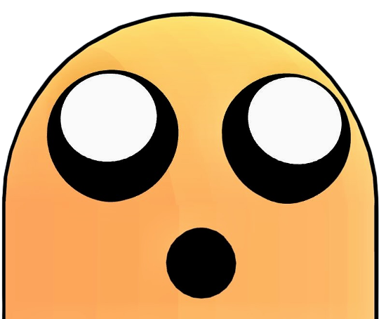
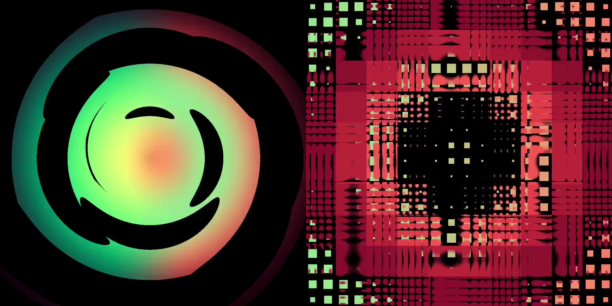

<h1 align="center">Intro To Shaders sketch manager</h1>

<p align="center">
    <a href="https://offscreencanvas.com" target="_blank" rel="noopener noreferrer">
        
    </a>
    <a href="https://offscreencanvas.com" target="_blank" rel="noopener noreferrer">
        
    </a>
    <a href="https://offscreencanvas.com" target="_blank" rel="noopener noreferrer">
        
    </a>
</p>

[](https://offscreencanvas.com/renders/demo-title)

Sketch management setup for ThreeJS Made for ["Intro to shaders" email course](https://offscreencanvas.com/courses/intro-to-shaders).

In src/sketches there is one glsl file per lesson, this is where you code.

And in src/lessons-final-sketches there is the final result of all the lessons for reference.

[Follow along with the email course signup!](https://offscreencanvas.com/courses/intro-to-shaders)

If you are interested about learning or exploring shaders, 3d, or creative coding, check out my weekly newsletter. We've got new resources/demos/articles each week. 

[Offscreen Canvas](https://offscreencanvas.com/)

## Installing & Running

```
yarn install
yarn dev
```

OR

```
npm install
npm run dev
```

1. Create a new sketch in the sketch file. (if not using the existing)
2. Done. Create your fullscreen fragment shader!

### Files && comments

| file | Description |
| --- | --- |
| sketches/*.glsl | Any file.glsl inside sketches is considered an sketch. Indexes are optional but recomended |
| lessons-final-sketches/*.glsl | Final result of all the lessons in the course. These files are not used as actual sketches |
| demo.js | The meat of the demo |
| rendering.js | All the threeJS rendering |
| utils.js | Functions manage the sketch setup. |


### Controls

| keybind | Description |
| --- | --- |
| ArrowLeft/ArrowRight | Change between sketches |

### Details

- Uses ThreeJS RawShader to avoid incorrect line numbers on errors. So, automatic shader stuff is not added

## License

This resource can be used freely if integrated or build upon in personal or commercial projects such as websites, web apps and web templates intended for sale. It is not allowed to take the resource "as-is" and sell it, redistribute, re-publish it, or sell "pluginized" versions of it. Free plugins built using this resource should have a visible mention and link to the original work. Always consider the licenses of all included libraries, scripts and images used.

## Social

Made for [Offscreen Canvas](https://offscreencanvas.com/)
By [Daniel Velasquez @Anemolito](https://twitter.com/Anemolito)

[Twitter](https://twitter.com/Anemolito) - [Portfolio](https://velasquezdaniel.com/) - [Github](https://github.com/Anemolo) - [Offscreen Canvas](https://offscreencanvas.com/)
